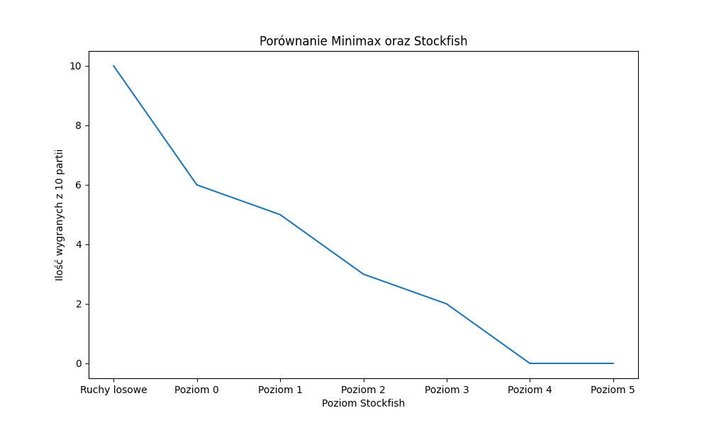

## Chess Heuristic Function Model 

### Data

Evaluated by Stockfish positions: [Lichess Elite Database](https://lichess.org/team/lichess-elite-database)

### Model

* Layer contains Linear, Batchnorm1d, Tanh.
* Layer sizes: [384 + 1, 500, 800, 1000, 1000, 1000, 1000, 800, 600, 400, 200, 128]
* Number of parameters: 6M

### Stockfish Evaluation

via [FastApi repository](https://github.com/skoda-octavia/chess-server)

Games were simulated using alpha-beta pruning depth 6 with Stockfish on different levels and random moves:

